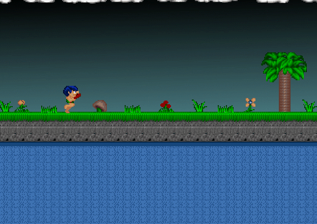

# Caveman Sprite #

This is my first DirectX project and one of my first C/C++ apps in Visual Studio. I promise my professional code is better. :)

I started with the Chapter 8 sample code and assets from Jonathan Harbour's *Beginning Game Programming*. The sample code just had the caveman continuously walk to the right, warping back to the left edge when it went offscreen. I modified the code so you can control the caveman's movement with the left and right arrow keys and make him jump by pressing spacebar. Also, I flip the sprite with a texture transform so he faces left when walking left.

